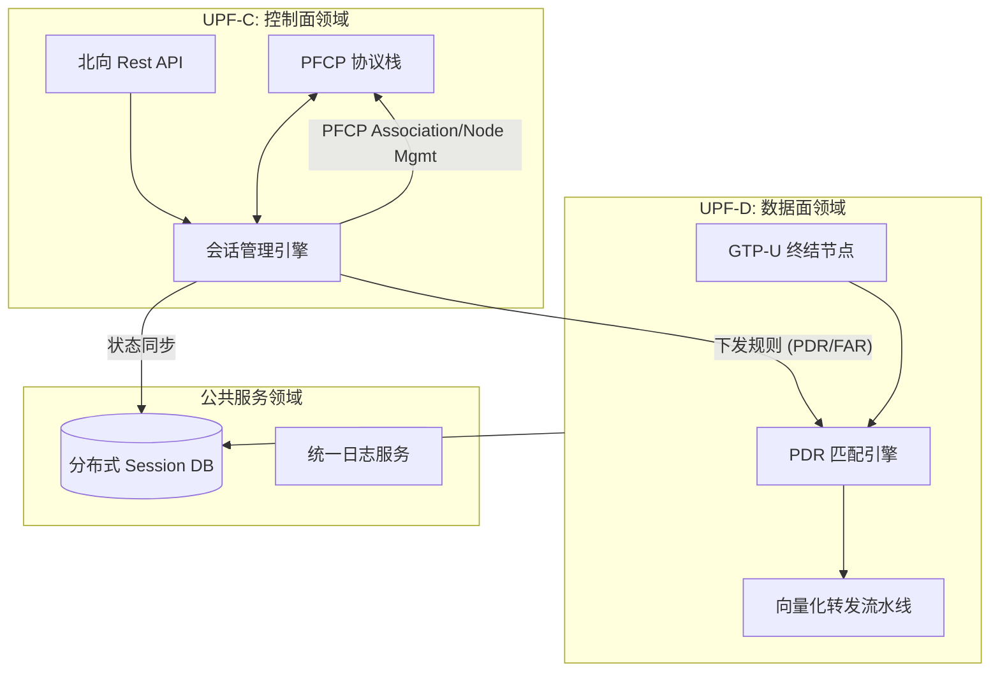

# 5G UPF 逻辑视图 (Logical View)

## 1. 核心架构拓扑
采用 CU (Control/User Plane) 分离架构，控制面基于 Go 协程池，数据面基于 VPP 向量化转发。

```mermaid
graph TB
    subgraph Control_Plane [UPF-C: 控制面领域]
        PFCP_Stack[PFCP 协议栈]
        Sess_Mgr[会话管理引擎]
        CP_API[北向 Rest API]
    end

    subgraph User_Plane [UPF-D: 数据面领域]
        GTPU_Node[GTP-U 终结节点]
        PDR_Lookup[PDR 匹配引擎]
        Forwarding[向量化转发流水线]
    end

    subgraph Service_Common [公共服务领域]
        DDB[(分布式 Session DB)]
        Logging[统一日志服务]
    end

    %% 交互关系
    CP_API --> Sess_Mgr
    PFCP_Stack <--> Sess_Mgr
    Sess_Mgr -- PFCP Association/Node Mgmt --> PFCP_Stack
    
    Sess_Mgr -- 下发规则 (PDR/FAR) --> PDR_Lookup
    GTPU_Node --> PDR_Lookup
    PDR_Lookup --> Forwarding
    
    Sess_Mgr -- 状态同步 --> DDB
    User_Plane -- 统计上报 --> DDB
```

---
*Generated by Gemini CLI using Mermaid.js.*
