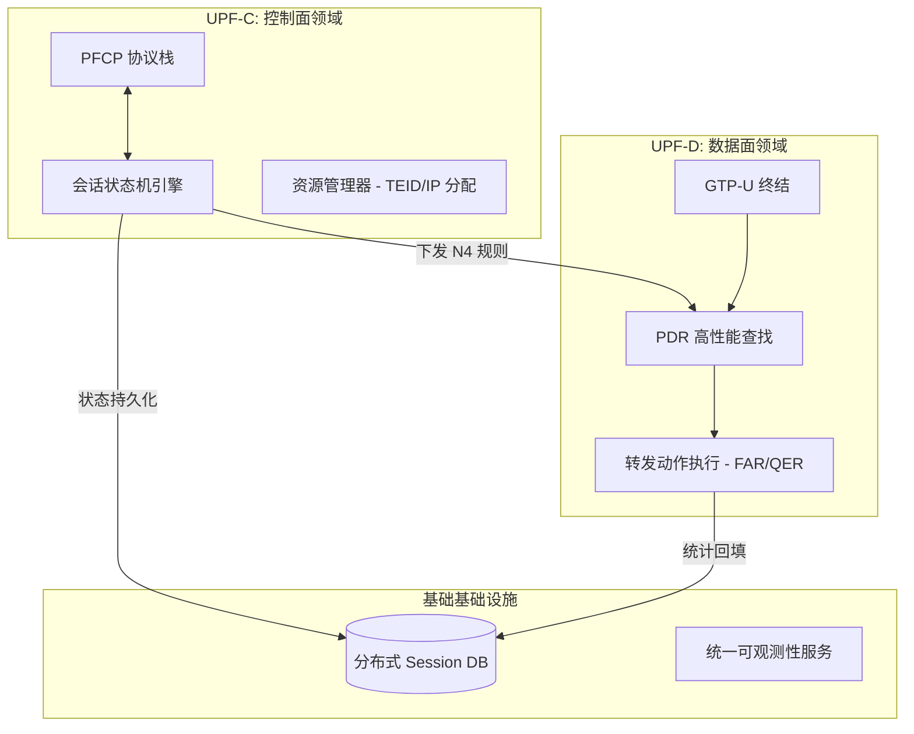
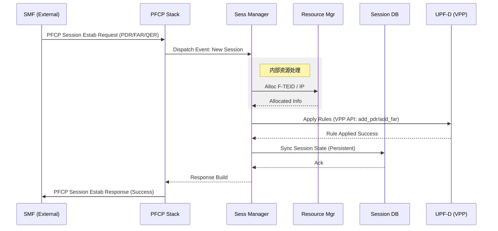
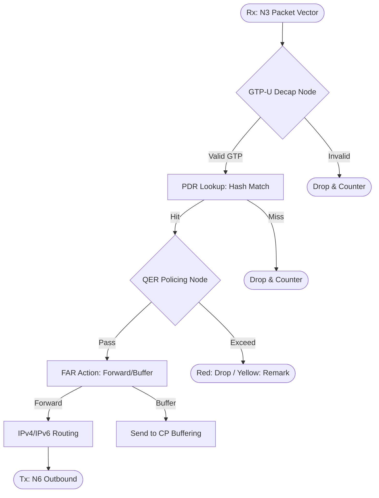
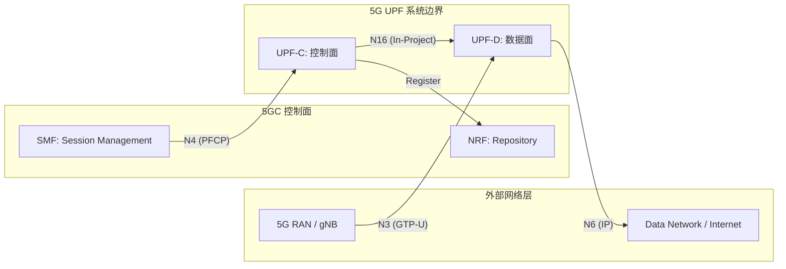

# 5G UPF 系统设计说明书 (SDS - IPD 标准 v0.3)

## 1. 逻辑视图 (Logical View)

### 1.1 逻辑模型 (Logic Model)
系统采用 **CU (Control/User) 分离** 的微服务架构，核心组件包括控制面核心 (UPF-C)、高性能数据面 (UPF-D) 及共享状态库 (SDB)。



### 1.2 数据模型 (Data Model)
核心业务对象采用层级化关联结构，确保 PFCP 规则的高效检索与动态更新。

- **Session (会话对象)**: 以 SEID (Session ID) 为主键，包含 UE 地址及关联的 PDR 列表。
- **PDR (Packet Detection Rule)**: 匹配模板，包含 Precedence, PDI (Source Interface, F-TEID, AppID)。
- **FAR (Forwarding Action Rule)**: 转发动作，定义 Drop, Forward, Buffering。
- **QER (QoS Enforcement Rule)**: 质量控制，包含 MBR (Maximum Bit Rate), 5QI。
- **URR (Usage Reporting Rule)**: 计费与测量，定义量配额与上报阈值。

### 1.3 领域模型 (Domain Model)
基于 3GPP TS 23.501 抽象的核心实体关系：
- **Entity: PDU Session**: 用户面连接的根实体。
- **Value Object: F-TEID**: 全局唯一的隧道端点标识（IP + TEID）。
- **Entity: Endpoint**: 对应 N3 (RAN), N6 (DN), N9 (I-UPF) 的逻辑接入点。

### 1.4 功能模型 (Functional Model)
将核心 SR 需求映射至逻辑单元：
- **路由管理子系统**: 承载 `SR.UPF.004` 系列需求，物理负责 VPP FIB 表项的注入与查询优化。
- **转发加速引擎**: 承载 `SR.UPF.002` 系列需求，实现 N3/N6 之间的线速转发。
| 功能单元 | 承载 SR 规格 | 核心职责 |
| :--- | :--- | :--- |
| **会话处理器** | SR.UPF.003.01.* | 处理 PFCP 建立/修改/删除流转。 |
| **转发流水线** | SR.UPF.003.02.* | 实现 GTP-U 向量化剥离与 PDR 匹配。 |
| **限速引擎** | SR.UPF.003.03.* | 基于双令牌桶 (Token Bucket) 执行 QER。 |

### 1.5 技术模型 (Technical Model)
- **控制面 (CP)**: Go 1.21+, 基于并发协程模型处理信令。
- **数据面 (DP)**: VPP 23.10+, C 语言开发插件，利用 DPDK 进行硬件加速。
- **通信协议**:
    - **N4 接口**: 二进制 PFCP 编码。
    - **内部通信**: 高性能二进制协议 (VPP API)。
    - **北向接口**: RESTful / gRPC。

## 2. 开发视图 (Development View)

### 2.1 代码模型 (Code Model)
采用基于“领域-职责”的扁平化源码组织结构，严格隔离控制面与数据面实现。

- **`src/cp-core/`**: 控制面核心。包含 PFCP 协议栈、会话管理。依赖 `src/svc-common/`。
- **`src/dp-vpp-plugins/`**: 数据面高性能插件。包含 VPP Node、GTP-U 剥离、PDR 匹配。
- **`src/svc-common/`**: 通用组件领域。包含统一日志、DDB 客户端接口、配置解析。
- **`src/cfg-schema/`**: 业务配置模型（YANG/JSON Schema）。
- **`test/`**:
    - **`test/it-integration/`**: 跨模块集成测试用例。
    - **`test/st-system/`**: 端到端业务与性能验收用例。

**代码规范**:
- **C/C++**: `snake_case`, 大括号换行, 华为安全编码基线。
- **Go**: 标准 Go 规范, `snake_case` (与项目对齐)。

### 2.2 构建模型 (Build Model)
项目采用 **Make** 作为统一构建入口，集成多阶段流水线。

| 构建阶段 | 对应指令 | 职责说明 |
| :--- | :--- | :--- |
| **需求同步** | `make sync-reqs` | 确保 `spec-srs.md` 与特性清单 100% 同步。 |
| **文档校验** | `make auto-doc-check` | 拦截 GEMINI.md 与 README.md 的不一致。 |
| **静态分析** | `make lint-go` / `lint-c` | 执行 golangci-lint, cppcheck, clang-tidy。 |
| **动态审计** | `make test-asan` | 启用 AddressSanitizer 扫描内存缺陷。 |
| **评审审计** | `make tr-audit` | 自动生成 TR 里程碑准备度报告。 |

**CI 流水线流程**:
`Git Push` -> `auto-doc-check` -> `Lint` -> `TDD Unit Tests (ASan)` -> `Auto TR Report`。

## 3. 部署视图 (Deployment View)

### 3.1 交付模型 (Delivery Model)
本项目通过标准的容器化产物进行交付，支持通过私有仓库或离线包部署。

| 交付产物 | 格式 | 描述 |
| :--- | :--- | :--- |
| **upf-cp-image** | Docker Image | 控制面微服务镜像 (Go)。 |
| **upf-dp-image** | Docker Image | 数据面 VPP 插件化镜像 (C/VPP)。 |
| **upf-charts** | Helm Chart | 包含 CP/DP/SDB 编排逻辑及资源定义。 |
| **config-schema** | JSON/YANG | 描述各版本支持的业务配置范围。 |
| **sbom-report** | Markdown | 归档该版本的第三方依赖成分清单 (mgr-ipd-sbom-audit)。 |

### 3.2 部署模型 (Deployment Model)
基于 K8s 的典型部署拓扑，采用 **Multus CNI** 实现管理/信令/数据三平面物理隔离。

```mermaid
graph TB
    subgraph K8s_Node [K8s Worker Node (High Performance)]
        subgraph Pod_DP [UPF-D Pod (Data Plane)]
            VPP_Proc[VPP Engine]
            SRIOV_VF1[SR-IOV VF: N3]
            SRIOV_VF2[SR-IOV VF: N6]
        end

        subgraph Pod_CP [UPF-C Pod (Control Plane)]
            Go_App[CP App]
            Signal_Nic[Signal Plane Nic]
        end

        subgraph Pod_SDB [State DB Pod]
            Redis_Proc[Redis/SDB Instance]
        end
    end

    %% 硬件直通映射
    NIC[(Smart NIC)] -- SR-IOV VF1 --> SRIOV_VF1
    NIC -- SR-IOV VF2 --> SRIOV_VF2

    %% 资源硬约束
    VPP_Proc -- CPU Pinning --> Core_Isolated[Isolated CPU Cores]
    VPP_Proc -- Mem Allocation --> HugePages[1G HugePages]
```

**部署硬约束清单**:
1. **硬件直通**: 数据面必须配置 `intel.com/sriov` 资源申请，直接映射 VF 接口。
2. **QoS Guaranteed**: 所有 Pod 的 `requests == limits`，确保 CPU 亲和性。
3. **高可用隔离**: CP 与 DP Pod 必须配置 **podAntiAffinity**，禁止在同一物理 Node 上运行。
4. **平面隔离**: 采用 Multus 为 DP 挂载多网口，确保 N3/N6 流量不经过 K8s 虚拟网桥。

## 4. 运行视图 (Runtime View)

### 4.1 运行模型-顺序图 (Sequence)
描述 PFCP Session Establishment 过程中的跨组件同步逻辑。



### 4.2 运行模型-活动图 (Activity)
描述数据面报文在 VPP 转发流水线中的向量化处理路径。



**运行约束**:
1. **非阻塞**: 控制面状态机严禁执行磁盘写操作，所有 SDB 操作必须通过异步协程完成。
2. **向量化处理**: 数据面每个 Node 必须至少处理 4 个报文的 Batch，以最大化指令缓存效率。
3. **统计打点**: 每一个 Drop 判定路径必须同步触发对应的 `error_counter` 累加。

## 5. 用例视图 (Use Case View)

### 5.1 上下文模型 (Context Model)
描述 5G UPF 在 5G 核心网架构中的位置及外部接口边界。



### 5.2 用例模型 (Use Case Model)
定义驱动架构设计的核心业务场景及其达成目标。

| 用例名称 | 涉及接口 | 业务价值 |
| :--- | :--- | :--- |
| **PDU 会话建立** | N4 / N3 | 实现用户终端从无线侧到数据网络的端到端打通。 |
| **多级 QoS 监管** | N4 / N3 / N6 | 确保高优先级业务（如 VoNR）在拥塞时带宽不受损。 |
| **计费与流量测量** | N4 / N3 | 提供准确的字节级统计，支撑运营商的流量变现。 |
| **异常路径自愈** | N4 / SDB | 在单个 Node 故障时实现会话状态的秒级迁移。 |
| **DPI 深度业务识别** | N6 / DN | 识别应用层协议（如视频/即时通讯），执行差异化转发策略。 |

**设计驱动准则**:
1. **协议遵从**: 100% 遵从 3GPP TS 23.501/502 定义的业务流程。
2. **高性能隔离**: 确保控制面管理任务（如 NRF 注册）不干扰数据面极速转发性能。
3. **可扩展性**: 接口设计需支持未来 R17/R18 等特性的平滑扩展（如 5G LAN, TSC）。

## 6. 详细设计 (Detailed Design - LLD)

### 6.1 控制面会话管理 (Session Management LLD)
会话管理器通过哈希表 (SEID Hash Map) 实现会话的秒级检索。状态机处理 PFCP 消息时，遵循事件驱动模型，通过无锁队列与 I/O 协程通信。

### 6.2 数据面转发流水线 (Forwarding Plane LLD)
VPP 插件通过向量化 (Vectorization) 处理报文，每批处理 256 个报文。PDR 匹配采用双级 Hash 表：第一级基于 F-TEID，第二级基于 PDI 细化条件，确保在 100 万级会话下依然保持恒定的转发时延。

---
*Generated by arch-hld-expert based on 14-Model Standards.*
